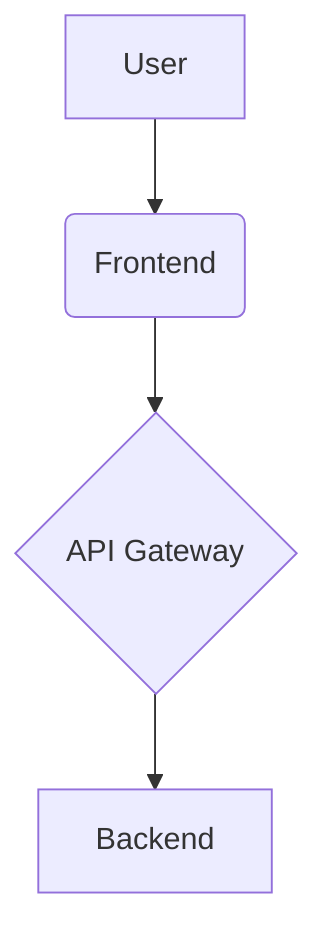
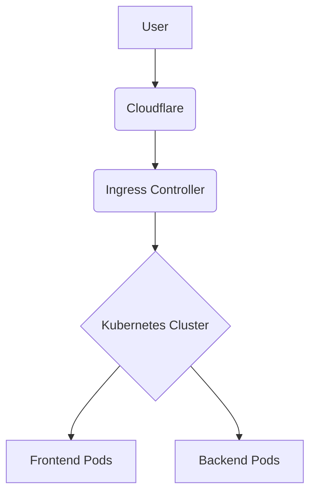
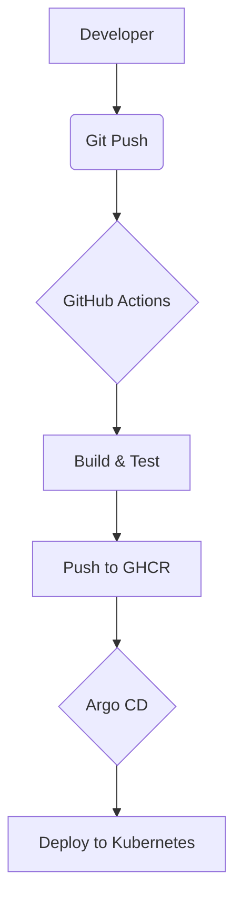

# Architecture

:::info This document provides a high-level overview of the project's architecture, including the application, infrastructure, and deployment flow. :::

## Application Architecture

The application is composed of a frontend, a backend, and an API gateway.

## Infrastructure Architecture

The infrastructure is hosted on a Kubernetes cluster, with Cloudflare for DNS and an Ingress Controller for routing traffic.

## Deployment Flow

We use a GitOps approach for deployments, with GitHub Actions for CI and Argo CD for CD.

